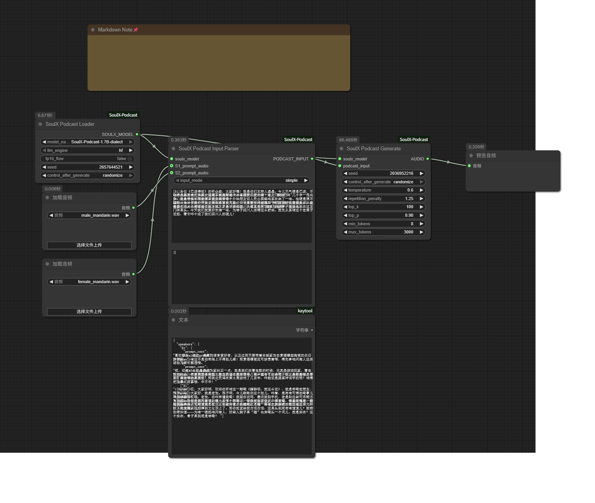

# ComfyUI-SoulX-Podcast 

**[English](README_EN.md) | [中文](README.md)**

## 项目简介

ComfyUI-SoulX-Podcast 是一个用于 ComfyUI 的自定义节点插件，将 SoulX-Podcast 的核心功能（长篇、多说话人、多方言的播客语音生成）封装为可视化的节点工作流。

## ✨ 主要特性

- 🎙️ **双人播客生成**：支持两个说话人的对话生成
- 🌍 **多方言支持**：支持多种中文方言（需使用方言模型）
- 📝 **灵活的对话脚本**：通过简单的脚本格式定义对话
- 🎵 **提示音频驱动**：使用参考音频（Suno）来克隆说话人的音色
- 🔄 **长文本生成**：支持生成长篇播客内容
- 🎛️ **可视化工作流**：在 ComfyUI 中通过节点连接完成整个生成流程

## 📦 安装与要求

### Python 依赖

确保您的 ComfyUI 环境已安装以下关键依赖：

```bash
s3tokenizer
diffusers
torch (需要 CUDA 支持)
transformers
onnxruntime (或 onnxruntime-gpu)
einops
librosa
scipy
```

> **⚠️ 重要注意事项**：本项目需要 `transformers==4.57.1`，请谨慎安装。其他版本的 transformers 可能会导致兼容性问题。

### 模型准备

模型文件需要放置在 ComfyUI 的标准模型目录下：

```
ComfyUI/models/TTS/[模型名称]/
```

**目录结构示例**：

```
ComfyUI/
  └── models/
      └── TTS/
          └── SoulX-Podcast-1.7B/
              ├── soulxpodcast_config.json
              ├── flow.pt
              ├── hift.pt
              ├── campplus.onnx
              └── [LLM模型文件...]
```

**模型类型说明**：

- **标准模型**（如 `SoulX-Podcast-1.7B`）：适用于标准普通话播客生成
- **方言模型**（如 `SoulX-Podcast-1.7B-dialect`）：支持多种中文方言生成，如河南话、四川话、粤语等

> **重要提示**：如需使用方言功能，请确保加载 `SoulX-Podcast-1.7B-dialect` 模型。在 **SoulX Podcast Loader** 节点的 `model_name` 参数中选择对应的方言模型。

## 🚀 快速开始

### 基本工作流

1. **SoulX Podcast Loader** - 加载模型
2. **加载音频** - 为每个说话人准备提示音频（使用 ComfyUI 的 "加载音频" 节点）
3. **SoulX Podcast Input Parser** - 解析输入和对话脚本
4. **SoulX Podcast Generate** - 生成播客音频
5. **预览/保存音频** - 使用 ComfyUI 的音频保存节点

### 工作流示例

以下是一个完整的 ComfyUI 工作流示例，展示了如何使用这些节点：



**导入工作流**：

您可以直接在 ComfyUI 中导入工作流 JSON 文件：`example/example_workflow.json`

该示例包含：
- 模型加载配置
- 双说话人提示音频（男声和女声）
- 完整的对话脚本示例
- 所有必需的节点连接

## 📖 节点说明

### 节点一：SoulX Podcast Loader（模型加载器）

**功能**：一次性加载所有必需的模型和分词器。

#### 输入参数

| 参数名 | 类型 | 默认值 | 说明 |
|--------|------|--------|------|
| **model_name** | 下拉选择 | 第一个可用模型 | 从 `models/TTS/` 目录下选择要使用的模型 |
| **llm_engine** | 选择 | `hf` | LLM 推理引擎：`hf` (HuggingFace) 或 `vllm` |
| **fp16_flow** | 布尔 | `False` | 是否使用 FP16 精度运行 Flow 模型 |
| **seed** | 整数 | `1988` | 随机种子，范围：0 到 4294967295 |

#### 输出

- **SOULX_MODEL**：包含所有已加载模型的对象

---

### 节点二：SoulX Podcast Input Parser（播客输入处理器）

**功能**：处理所有输入数据（音频、文本、对话脚本），并预处理为模型可以使用的格式。**支持双人对话（S1和S2）**。

#### 必需输入

| 参数名 | 类型 | 说明 |
|--------|------|------|
| **soulx_model** | SOULX_MODEL | 从 SoulX Podcast Loader 节点传入的模型对象 |
| **input_mode** | 选择 | 输入模式：`simple`（简单模式）或 `json`（JSON模式） |

#### 简单模式输入（input_mode = "simple"）

| 参数名 | 类型 | 说明 |
|--------|------|------|
| **S1_prompt_audio** | AUDIO | 说话人1（S1）的提示音频，用于提取音色特征 |
| **S2_prompt_audio** | AUDIO | 说话人2（S2）的提示音频（可选，用于双人对话） |
| **dialogue_script** | 多行文本 | 对话脚本，定义整个播客的对话内容<br>格式：`[S1] 第一句话\n[S2] 第二句话`<br>系统会自动从每个说话人的第一句话中提取提示文本 |

#### 输出

- **PODCAST_INPUT**：包含所有预处理数据的对象

**处理流程**：
1. 解析对话脚本，提取每句话的文本和说话人标识
2. 从提示音频中提取说话人嵌入特征
3. 提取音频的梅尔频谱特征
4. 将文本转换为 token IDs
5. 打包所有预处理数据

---

### 节点三：SoulX Podcast Generate（播客生成器）

**功能**：执行核心的推理循环，生成最终播客音频。

#### 必需输入

| 参数名 | 类型 | 说明 |
|--------|------|------|
| **soulx_model** | SOULX_MODEL | 从 Loader 节点传入的模型对象 |
| **podcast_input** | PODCAST_INPUT | 从 Input Parser 节点传入的预处理数据 |
| **seed** | 整数 | 随机种子 |
| **temperature** | 浮点数 | LLM 采样温度（默认：0.6，范围：0.1-2.0） |
| **repetition_penalty** | 浮点数 | 重复惩罚系数（默认：1.25，范围：1.0-2.0） |

#### 可选输入

| 参数名 | 类型 | 默认值 | 说明 |
|--------|------|--------|------|
| **top_k** | 整数 | 100 | Top-K 采样（范围：1-200） |
| **top_p** | 浮点数 | 0.9 | Nucleus 采样（范围：0.1-1.0） |
| **min_tokens** | 整数 | 8 | 每句话最少生成的 token 数量（范围：1-100） |
| **max_tokens** | 整数 | 3000 | 每句话最多生成的 token 数量（范围：100-5000） |

#### 输出

- **AUDIO**：生成的完整播客音频（24kHz，符合 ComfyUI AUDIO 格式）

---

## ⚙️ 参数调优建议

### 音质优化

- **提示音频质量**：使用清晰、无噪音的提示音频，时长 5-15 秒最佳
- **fp16_flow**：如果显存充足，建议关闭以获得最佳音质

### 生成稳定性

- **temperature**：0.5-0.7 适合对话，0.7-0.9 适合创意内容
- **repetition_penalty**：1.15-1.35 是较好的范围
- **top_k / top_p**：通常保持默认即可

### 性能优化

- **llm_engine**：如果有 vllm 且显存充足，使用 `vllm` 可提升速度
- **fp16_flow**：开启可减少显存占用
- **max_tokens**：根据实际需求调整，不要设置过大

---

## 🔧 常见问题

### Q1: 模型加载失败

**问题**：提示 "Model path does not exist" 或 "No models found"

**解决方案**：
1. 确保模型文件放在 `ComfyUI/models/TTS/[模型名称]/` 目录下
2. 检查模型目录是否包含所有必需文件

### Q2: 生成音频音色不稳定

**解决方案**：
1. 使用更长、更清晰的提示音频（建议 10 秒左右）
2. 确保提示音频质量良好，无明显噪音

### Q3: 生成速度慢

**解决方案**：
1. 如果支持，使用 `vllm` 引擎
2. 开启 `fp16_flow` 减少显存占用
3. 减少 `max_tokens` 值

### Q4: 对话脚本格式错误

**错误示例**：
```
S1 你好  # ❌ 缺少方括号
```

**正确格式**：
```
[S1] 你好  # ✅ 正确
[S2] 你好  # ✅ 正确
```


---

## 📚 技术架构

### 生成流程

```
文本输入 → LLM → 语义Token → Flow → 梅尔频谱 → HiFT → 音频波形
```

### 核心模型

- **LLM**：Qwen3-1.7B（语言模型）
- **Flow**：CausalMaskedDiffWithXvec（声学模型）
- **HiFT**：HiFTGenerator（声码器）
- **Suno 提取**：campplus.onnx（说话人嵌入提取）

---

## 📄 许可证

本项目基于 SoulX-Podcast 项目开发，请遵循原项目的许可证要求。

---

## 🙏 致谢

- [SoulX-Podcast](https://github.com/...) - 原始项目
- ComfyUI 社区

---

## 📧 支持

如有问题或建议，请在项目 Issues 中提交。

